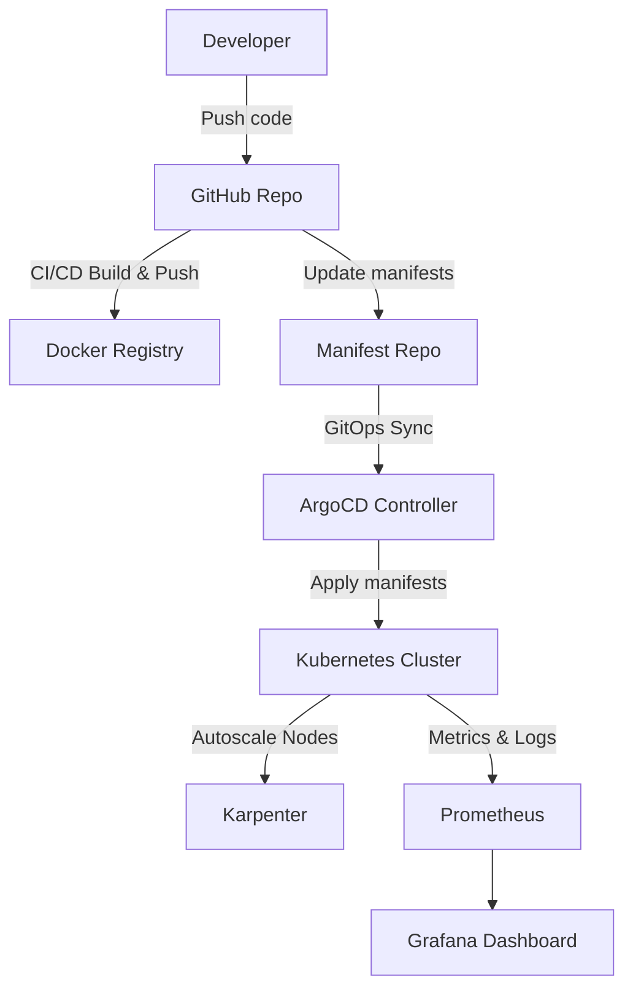

# Device Microservices Backend Deployment

## Overview
This system is deployed following a **GitOps** workflow with ArgoCD, **Autoscaling** using Karpenter, **Observability** with Grafana & Prometheus, and **CI/CD** via GitHub Actions + Docker Registry.

---

## 1. Deploy ArgoCD
**Goal:** Manage GitOps and synchronize manifests from GitHub to the Kubernetes Cluster.

### Step 1: Install ArgoCD
```bash
kubectl create namespace argocd
kubectl apply -n argocd -f https://raw.githubusercontent.com/argoproj/argo-cd/stable/manifests/install.yaml
````

### Step 2: Log in to ArgoCD

```bash
# Get the admin password
kubectl get secret argocd-initial-admin-secret -n argocd \
  -o jsonpath="{.data.password}" | base64 -d

# Port forward
kubectl port-forward svc/argocd-server -n argocd 8080:443
```

Access at: [https://localhost:8080](https://localhost:8080)

### Step 3: Create Application & Project

* Add `application.yaml` and `project.yaml` files in the manifest repository.

### Step 4: Verify in ArgoCD UI

* Check resources status (`Synced/Healthy`) in the UI.

---

## 2. Deploy Karpenter

**Goal:** Automatically scale nodes based on workload demand.

### Step 1: Create manifests

* **EC2NodeClass**: defines AMI, IAM Role, subnets, security groups.
* **NodePool**: defines autoscaling policy, instance types, capacity type.

### Step 2: Install Helm chart

```bash
helm upgrade --install karpenter oci://public.ecr.aws/karpenter/karpenter \
  --namespace karpenter --create-namespace \
  --version <KARPENTER_VERSION> \
  --set "serviceAccount.annotations.eks\.amazonaws\.com/role-arn=<KARPENTER_IAM_ROLE_ARN>" \
  --set "settings.clusterName=<CLUSTER_NAME>" \
  --set "settings.interruptionQueueName=<SQS_QUEUE_NAME>"
```

---

## 3. Deploy Grafana and Prometheus

**Goal:** Monitoring & observability for the system.

### Step 1: Add Helm repositories

```bash
helm repo add grafana-charts https://grafana.github.io/helm-charts
helm repo add prometheus-community https://prometheus-community.github.io/helm-charts
helm repo update
```

### Step 2: Install Prometheus & Grafana

* Create `prometheus-values.yaml` and `grafana-values.yaml` to override default Helm configs.

```bash
helm install prometheus prometheus-community/kube-prometheus-stack -n monitoring -f prometheus-values.yaml
helm install grafana grafana-charts/grafana -n monitoring -f grafana-values.yaml
```

### Step 3: Retrieve Grafana admin password

```bash
kubectl get secret --namespace monitoring grafana \
  -o jsonpath="{.data.admin-password}" | base64 --decode
```

---

## 4. CI/CD Workflow

**Goal:** Automate build, push, and deploy of microservices.

### Step 1: Manage Secrets

* Add **Secrets** in the GitHub repository for:

  * API keys
  * DB credentials
  * Environment variables
* Avoid hard-coding sensitive data in the source code.


### Step 2: CI/CD Flow

1. Developer pushes new code to GitHub.
2. GitHub Actions pipeline:

   * Builds Docker image.
   * Pushes image to Docker Registry (ECR/GHCR).
   * Updates `image.tag` in the manifest repository.
3. ArgoCD syncs the manifests → Kubernetes pulls the new image and redeploys.

---

## Deployment Workflow Diagram


# Frontend for Amplify Deployment

This repository contains the frontend application configured for deployment using **AWS Amplify**.
Amplify provides hosting, CI/CD, and integration with backend resources such as APIs, authentication, and storage.
## Terraform
https://github.com/codeweb2005/Frontend_Microservice_Amplify
 
https://github.com/codeweb2005/Frontend-Resources

# Helm Repository for ArgoCD Deployment

This repository contains the Helm manifests used to deploy resources into the cluster via ArgoCD. : https://github.com/codeweb2005/Helm
